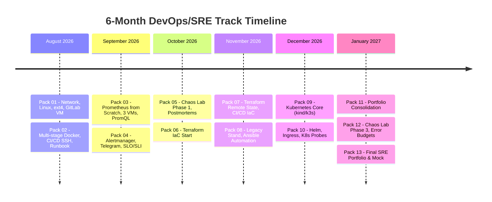

# Track Curriculum: DevOps / SRE Engineering Journey

A 6-month intensive hands-on engineering program: **13 two-week packs** (from August 4, 2026 to February 1, 2027).

The goal is building authentic SRE engineering mindset backed by verifiable code artifacts, operational testing stands, automated pipelines, and real incident resolution experience.

---

## 🗺️ Program Structure & Timeline

---

## 📋 Detailed Pack Breakdown (01–13)

### Phase 1: Linux Foundations, Containers & CI/CD (August 2026)

* **🟢 [Pack 01 · Aug 4–17](pack-01/index.md) — Linux Network Stack & Stand Recovery (Completed)**
    * Disaster recovery of `ext4` filesystem (`fsck`, superblocks, `/etc/fstab`).
    * GitLab VM setup and GitLab Runner registration with `dind` executor.
    * Linux networking stack: TCP handshakes, socket inspection (`ss`, `tcpdump`), SSH key management.
    * First declarative `.gitlab-ci.yml`.

* **🟡 [Pack 02 · Aug 18–31](pack-02/index.md) — Multi-stage Docker, CI/CD SSH Deploy & Rollback Runbook (In Progress)**
    * Multi-stage Dockerfile: layer optimization, non-root `appuser`, build security.
    * Automated deployment via SSH pegged to `$CI_COMMIT_SHORT_SHA` (ban on `latest` tag).
    * Formalized Rollback Runbook for emergency recovery ($\le 60$ sec).
    * Nginx reverse proxy configuration and `X-Forwarded-*` header forwarding.

---

### Phase 2: Observability, Metrics & Alerting (September 2026)

* **⚪ [Pack 03 · Sep 1–14](pack-03/index.md) — Prometheus from Scratch, 3-VM Monitoring & PromQL (Planned)**
    * Deploying Prometheus from bare binaries across 3 VMs (no pre-packaged charts).
    * Observability data flow and topology diagram (Excalidraw).
    * OS and container exporters: `node_exporter` and `cAdvisor`.
    * Deep PromQL querying: instant vs range vectors, rate/irate, CPU/memory saturation calculations.

* **⚪ Pack 04 · Sep 15–28 — Alertmanager, Telegram Alerts & First SLO**
    * Alertmanager configuration, routing, and alert grouping.
    * Telegram bot notification integration.
    * Defining initial Service Level Indicators (SLI) and Service Level Objectives (SLO).
    * Running synthetic traffic generators to trigger and validate alerting.

---

### Phase 3: Engineering Chaos & Infrastructure as Code (October – November 2026)

* **⚪ Pack 05 · Sep 29–Oct 12 — Chaos Lab: Phase 1 & Postmortem Culture**
    * Controlled infrastructure faults: network jitter, disk corruption, OOM-killer.
    * Authoring the first two formal Incident Postmortems.
    * Establishing blameless culture and Root Cause Analysis (RCA) methodology.

* **⚪ Pack 06 · Oct 13–26 — Terraform Start: Cloud Infrastructure Management**
    * Declarative infrastructure as code using HCL.
    * Building the first reusable Terraform module.
    * Managing cloud resources (Compute, VPC, Security Groups).

* **⚪ Pack 07 · Oct 27–Nov 9 — Terraform Remote State & CI/CD Automation**
    * Remote state storage in S3 backend with distributed state locking.
    * Automating `terraform plan` and `terraform apply` within CI/CD pipelines.
    * Environment variable management and sensitive secret handling.

* **⚪ Pack 08 · Nov 10–23 — Inherited Legacy & Ansible Automation**
    * Auditing and adopting undocumented legacy infrastructure.
    * Writing Ansible playbooks to enforce desired state idempotently.
    * Roles, variables, Jinja2 templates, and dynamic inventory management.

---

### Phase 4: Container Orchestration with Kubernetes (December 2026)

* **⚪ Pack 09 · Nov 24–Dec 7 — Kubernetes Fundamentals (kind / k3s)**
    * Control plane (API server, etcd, scheduler, controller-manager) and worker nodes (kubelet, kube-proxy).
    * Authoring core manifests from scratch: Pod, ReplicaSet, Deployment, Service (ClusterIP/NodePort).
    * Container configuration with ConfigMap and Secrets.

* **⚪ Pack 10 · Dec 8–21 — Advanced Kubernetes: Helm, Ingress & Health Probes**
    * Packaging applications into Helm charts (templates, values.yaml, subcharts).
    * Setting up Nginx Ingress Controller and traffic routing.
    * Configuring `livenessProbe`, `readinessProbe`, and `startupProbe` for zero-downtime rolling updates.
    * Chaos Lab Phase 2: Node drain/failure scenarios.

---

### Phase 5: Consolidation, Uncontrolled Chaos & SRE Capstone (January 2027)

* **⚪ Pack 11 · Dec 22–Jan 4 — De-load Sprint & Portfolio Consolidation**
    * Codebase consolidation across all project repositories.
    * Writing clean technical English documentation and READMEs.
    * Security auditing and preparations for the final phase.

* **⚪ Pack 12 · Jan 5–18 — Chaos Lab: Phase 3 & Error Budgets**
    * Unscheduled random failure simulations.
    * Calculating and monitoring Error Budgets.
    * Comprehensive postmortem series with actionable architectural fixes.

* **⚪ Pack 13 · Jan 19–Feb 1 — SRE Portfolio Finalization & Mock Interviews**
    * Assembling the cohesive engineering portfolio: architecture diagrams, code, postmortems.
    * Recording walkthrough videos of deployment and rollback procedures.
    * Mock interview sessions with laptop closed.

---

## ⚖️ Engineering Constitution & Practice Principles

Strict production engineering rules apply across all packs:

1. **R1: Zero Manual Mutation.** Never mutate production servers manually. Every configuration change must flow through Git and automated pipelines.
2. **R2: Blast Radius & PR.** Every modification requires a Pull Request explicitly describing the blast radius and rollback plan.
3. **R3: 48-Hour Postmortem.** Incident postmortems with complete timelines and preventative measures must be published within 48 hours of an outage.
4. **R4: Zero Alert Noise.** Alerts must only trigger for actionable symptoms requiring immediate human intervention.
5. **R5: Tested Runbooks.** All disaster recovery runbooks must be tested literally and verified in practice.

---

## ⏱️ Shift Cycle Capacity Matrix

The sprints are engineered around an 8-day operational shift schedule:

| Slot | Description | Time | Purpose |
| :--- | :--- | :---: | :--- |
| **Slot A** | Weekday Evening | 2 h | Theory reading, code writing, PR creation |
| **Slot B** | Recovery Day | **0 h** | **Strictly rest and uninterrupted sleep** |
| **Slot C** | Day Off | 4 h | Deep hands-on lab work, debugging |
| **Slot D** | Day Off Evening | 2 h | Verification, sprint reporting, reflection |
