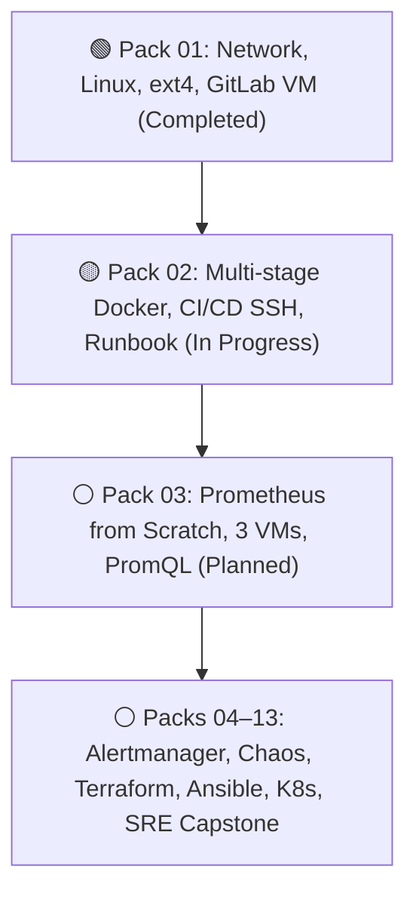

# DevOps / SRE Track Portal

Welcome to the personalized engineering portal for the **DevOps / SRE** track. This hub provides direct access to all sprints, hands-on tasks, checklists, architectural breakdowns, and the 6-month development roadmap.

---

## 🚀 Active Sprint: Pack 02 (August 18–31, 2026)

!!! warning "Active Sprint: Multi-stage Docker, CI/CD SSH Deploy & Rollback Runbook"
    **Sprint Focus:** Complete the automated delivery loop — multi-stage Docker builds, secure SSH deployment pinned to `$CI_COMMIT_SHORT_SHA`, emergency Rollback Runbook, and Pull Request engineering hygiene.

- :material-clipboard-text-outline: **[Sprint 02 Tasks](pack-02/tasks.md)**

    Hands-on engineering assignments with foundational "Why" rationale blocks

- :material-checkbox-marked-circle-outline: **[Acceptance Checklist](pack-02/checklist.md)**

    Step-by-step verification checklist for current sprint deliverables

- :material-lightbulb-on-outline: **[Fundamentals & Why](pack-02/fundamentals.md)**

    Architectural rationales: avoiding `:latest`, rollback determinism, DORA metrics

- :material-folder-eye-outline: **[Pack 02 Hub](pack-02/index.md)**

    Complete pack overview, theory index, interview questions, and self-check rubric

---

## 📊 Sprint Matrix & 6-Month Track Progress

| Pack | Dates | Status | Core Topics | Resources |
| :--- | :---: | :---: | :--- | :---: |
| **Pack 01** | Aug 4–17, 2026 | :material-check-decagram:{ .green } **Completed** | ext4 recovery, GitLab VM, Runner dind, SSH key security, Linux sockets | [Hub](pack-01/index.md) · [Tasks](pack-01/tasks.md) · [Checklist](pack-01/checklist.md) |
| **Pack 02** | Aug 18–31, 2026 | :material-progress-clock:{ .yellow } **In Progress** | Multi-stage Dockerfile, SSH deploy via SHA, Rollback runbook, Nginx | [Hub](pack-02/index.md) · [Tasks](pack-02/tasks.md) · [Checklist](pack-02/checklist.md) |
| **Pack 03** | Sep 1–14, 2026 | :material-calendar-clock:{ .blue } **Planned** | Prometheus from scratch across 3 VMs, Excalidraw topology, `node_exporter`, `cAdvisor`, PromQL | [Hub](pack-03/index.md) · [Tasks](pack-03/tasks.md) · [Checklist](pack-03/checklist.md) |
| **Packs 04–13** | Sep 2026 – Feb 2027 | :material-dots-horizontal-circle-outline: **Upcoming** | Alertmanager, Chaos Lab, Terraform, Ansible, Kubernetes, Helm, SRE Capstone | [Full Curriculum](curriculum.md) · [Interactive Roadmap](roadmap.html) |

---

## ⏱️ Shift Schedule & Capacity Model

Sprints are calibrated around an 8-day operational shift cycle:

| Slot | Day Type | Hours | Recommended Workload |
| :--- | :--- | :---: | :--- |
| **Slot A** | Day Off after Day Shifts | 4–5 h | Deep focus: Multi-stage Dockerfiles, CI/CD pipeline authoring, runbooks |
| **Slot B** | Recovery Day after Night Shifts | **0 h** | **Strictly rest and uninterrupted sleep.** Zero guilt, zero tasks |
| **Slot C** | Day Off after Recovery | 2–4 h | Lab stand practice: Nginx configuration, PR reviews, socket debugging |
| **Slot D** | Quiet Window / On-Call | 1–2 h | Documentation reading, RFC exploration, technical interview prep |

---

## 🧭 Portal Navigation Hub

- :material-map-legend: **[Full Curriculum Track](curriculum.md)**

    Comprehensive description of all 13 packs, engineering constitution rules, and gates

- :material-map-search: **[Visual 6-Month Roadmap](roadmap.html)**

    Interactive visual representation of technology milestones and project timelines

- :material-archive-outline: **[Knowledge Archive: Pack 01](pack-01/index.md)**

    Complete archive of tasks, theory, checklists, and guides from sprint 01

- :material-chart-line: **[September Plan: Pack 03](pack-03/index.md)**

    Production monitoring architecture, Prometheus deployment, and PromQL guides

---

!!! quote "Core Engineering Principle"
    Three tasks thoroughly implemented and deeply understood out-value eight tasks completed via superficial copying.
