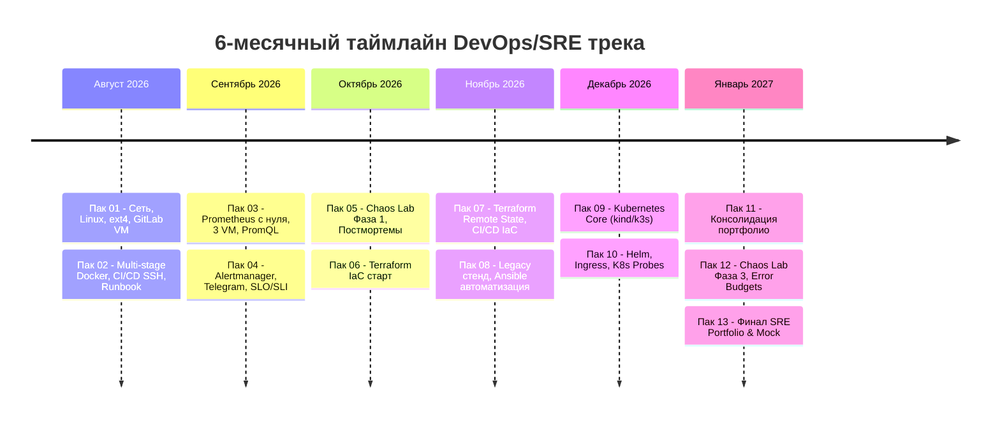

# Программа трека: Инженерная траектория DevOps / SRE

Шестимесячная интенсивная программа практической подготовки: **13 двухнедельных паков** (с 4 августа 2026 по 1 февраля 2027 года). 

Цель программы — формирование полноценного инженерного мышления SRE, подтверждённого реальными артефактами в коде, работающими стендами, автоматизированными пайплайнами и опытом ликвидации инцидентов.

---

## 🗺️ Структура и таймлайн программы

---

## 📋 Подробный план паков (01–13)

### Фаза 1: Фундамент Linux, Контейнеризация и CI/CD (Август 2026)

* **🟢 [Пак 01 · 4–17 авг](pack-01/index.md) — Сетевой стек Linux и восстановление стенда (Выполнен)**
    * Аварийное восстановление файловой системы `ext4` (`fsck`, суперблоки, `/etc/fstab`).
    * Развёртывание GitLab VM и регистрация GitLab Runner с `dind` executor.
    * Сетевой стек Linux: TCP handshake, анализ сокетов (`ss`, `tcpdump`), управление SSH ключами.
    * Первый декларативный `.gitlab-ci.yml`.

* **🟡 [Пак 02 · 18–31 авг](pack-02/index.md) — Multi-stage Docker, CI/CD SSH Deploy и Runbook отката (В процессе)**
    * Multi-stage Dockerfile: оптимизация слоёв, non-root `appuser`, безопасность сборки.
    * Автоматический деплой по `$CI_COMMIT_SHORT_SHA` через SSH (запрет тега `latest`).
    * Регламент отката (Rollback Runbook) при сбоях релизов ($\le 60$ сек).
    * Настройка Nginx reverse proxy и проброс заголовков `X-Forwarded-*`.

---

### Фаза 2: Наблюдаемость, Метрики и Алертинг (Сентябрь 2026)

* **⚪ [Пак 03 · 1–14 сен](pack-03/index.md) — Prometheus с нуля, Мониторинг 3 VM и PromQL (Запланирован)**
    * Развёртывание Prometheus с нуля на 3 виртуальных машинах (без готовых чартов).
    * Архитектурная топология потоков данных (Excalidraw).
    * Системные и контейнерные экспортеры: `node_exporter` и `cAdvisor`.
    * Глубокая практика PromQL: instant vs range vectors, rate/irate, расчёт утилизации CPU/RAM.

* **⚪ Пак 04 · 15–28 сен — Alertmanager, Оповещения в Telegram и первый SLO**
    * Настройка Alertmanager, маршрутизация и группировка алертов.
    * Интеграция с Telegram-ботом.
    * Определение первых Service Level Indicators (SLI) и Service Level Objectives (SLO).
    * Запуск генератора синтетической нагрузки для проверки алертинга.

---

### Фаза 3: Инженерный хаос и Инфраструктура как код (Октябрь – Ноябрь 2026)

* **⚪ Пак 05 · 29 сен–12 окт — Лабораторный хаос: Фаза 1 и культура постмортемов**
    * Управляемые сбои инфраструктуры: сетевой джиттер, отказ диска, OOM-killer.
    * Написание первых двух официальных постмортемов (Incident Postmortems) по инцидентам.
    * Внедрение принципов Blameless culture и Root Cause Analysis (RCA).

* **⚪ Пак 06 · 13–26 окт — Старт Terraform: Управление облачной инфраструктурой**
    * Декларативное описание инфраструктуры на HCL.
    * Написание первого переиспользуемого модуля Terraform.
    * Управление ресурсами облачного провайдера (Compute, VPC, Security Groups).

* **⚪ Пак 07 · 27 окт–9 ноя — Terraform Remote State и CI/CD Automation**
    * Хранение стейта в S3-совместимом бэкенде с распределённой блокировкой (State Locking).
    * Автоматизация `terraform plan` и `terraform apply` в изолированных CI/CD джобах.
    * Управление переменными окружения и безопасность чувствительных данных.

* **⚪ Пак 08 · 10–23 ноя — Унаследованная инфраструктура и автоматизация с Ansible**
    * Приёмка и аудит чужого "легаси"-стенда без документации.
    * Написание плейбуков Ansible для приведения хостов к целевому состоянию (idempotency).
    * Роли, переменные, шаблоны Jinja2 и inventory-менеджмент.

---

### Фаза 4: Оркестрация контейнеров Kubernetes (Декабрь 2026)

* **⚪ Пак 09 · 24 ноя–7 дек — Фундамент Kubernetes (kind / k3s)**
    * Архитектура control plane (API server, etcd, scheduler, controller-manager) и worker узлов (kubelet, kube-proxy).
    * Написание базовых манифестов вручную: Pod, ReplicaSet, Deployment, Service (ClusterIP/NodePort).
    * ConfigMap и Secrets: конфигурация контейнеров.

* **⚪ Пак 10 · 8–21 дек — Продвинутый Kubernetes: Helm, Ingress и Пробы живучести**
    * Упаковка приложений в Helm-чарты (шаблоны, values.yaml, зависимости).
    * Настройка Ingress-контроллера (Nginx Ingress) и маршрутизация трафика.
    * Настройка `livenessProbe`, `readinessProbe` и `startupProbe` для zero-downtime rolling updates.
    * Лабораторный хаос Фаза 2: падение ноды K8s и поведение подов.

---

### Фаза 5: Разгрузка, Неуправляемый хаос и SRE Финал (Январь 2027)

* **⚪ Пак 11 · 22 дек–4 янв — Разгрузочный спринт и Портфолио**
    * Консолидация кодовой базы всех репозиториев.
    * Документирование проектов и README на чистом техническом английском.
    * Аудит безопасности и подготовка к финальной фазе.

* **⚪ Пак 12 · 5–18 янв — Лабораторный хаос: Фаза 3 и Error Budgets**
    * Неконтролируемые внезапные аварии на живом стенде.
    * Расчёт и мониторинг Error Budget (бюджета ошибок).
    * Серия комплексных постмортемов с выводами и action items.

* **⚪ Пак 13 · 19 янв–1 фев — Финализация портфолио и подготовка к интервью**
    * Сборка цельного инженерного портфолио: схемы архитектуры, код, постмортемы.
    * Запись видеодемонстраций развёртывания и отката.
    * Серия финальных мок-интервью с закрытым ноутбуком (laptop closed).

---

## ⚖️ Инженерная конституция и принципы практики

Во всех паках действуют нерушимые правила продакшн-инженерии:

1. **R1: Zero Manual Mutation.** Запрещены ручные изменения конфигураций на серверах. Любое изменение вносится через Git и автоматизированный пайплайн.
2. **R2: Blast Radius & PR.** Каждое изменение сопровождается Pull Request с явным описанием радиуса поражения (blast radius) и плана отката.
3. **R3: Postmortem за 48 часов.** При возникновении инцидента в течение 48 часов составляется технический постмортем с таймлайном и preventative actions.
4. **R4: Zero Alert Noise.** Оповещения настраиваются только на симптомы, требующие немедленного действия инженера.
5. **R5: Tested Runbooks.** Любая инструкция аварийного восстановления должна быть дословно протестирована на практике.

---

## ⏱️ Модель рабочих слотов (Capacity Matrix)

Спринты рассчитаны на 8-дневный сменный график инженера:

| Слот | Описание | Время | Назначение |
| :--- | :--- | :---: | :--- |
| **Слот A** | Будни вечер | 2 ч | Теория, написание кода, оформление PR |
| **Слот B** | Отсыпной день | **0 ч** | **Строго полноценный отдых и сон** |
| **Слот C** | Выходной день | 4 ч | Глубокая практическая работа на стенде, дебаг |
| **Слот D** | Выходной вечер | 2 ч | Тестирование, подготовка отчёта, рефлексия |
