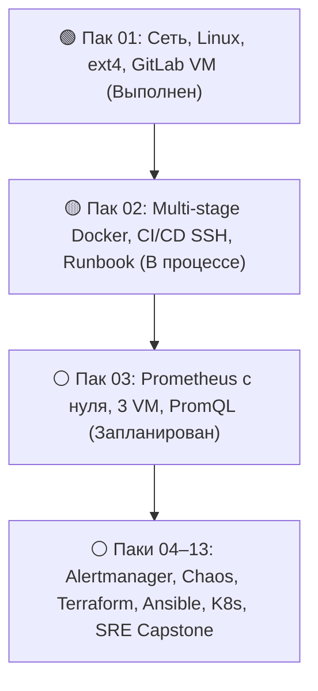

# Портал трека DevOps / SRE

Добро пожаловать на персональный инженерный портал практической подготовки по направлению **DevOps / SRE**. Здесь собраны все спринты, практические задания, чеклисты, архитектурные разборы и траектория развития на 6 месяцев.

---

## 🚀 Текущий спринт: Пак 02 (18–31 августа 2026)

!!! warning "Активный спринт: Multi-stage Docker, CI/CD SSH Deploy и Runbook отката"
    **Фокус спринта:** замкнуть контур автоматической доставки — multi-stage сборка Docker-образов, безопасный деплой по SSH на VM с тегированием по `$CI_COMMIT_SHORT_SHA`, регламент мгновенного отката (Rollback Runbook) и культура Pull Request.

- :material-clipboard-text-outline: **[Задачи спринта 02](pack-02/tasks.md)**

    Практические задания с обязательными блоками «Зачем»

- :material-checkbox-marked-circle-outline: **[Чеклист готовности](pack-02/checklist.md)**

    Рабочий чеклист критериев приёмки текущего спринта

- :material-lightbulb-on-outline: **[Почему всё устроено так](pack-02/fundamentals.md)**

    Архитектурные основания: отказ от `:latest`, детерминизм отката, DORA метрики

- :material-folder-eye-outline: **[Обзор пака 02](pack-02/index.md)**

    Полная структура материалов, теория, вопросы с интервью и рубрика самопроверки

---

## 📊 Матрица паков и прогресс программы

| Пак | Даты | Статус | Основные темы | Материалы |
| :--- | :---: | :---: | :--- | :---: |
| **Пак 01** | 4–17 авг 2026 | :material-check-decagram:{ .green } **Выполнен** | Восстановление ext4, GitLab VM, Runner dind, SSH ключи, Linux сокеты | [Обзор](pack-01/index.md) · [Задачи](pack-01/tasks.md) · [Чеклист](pack-01/checklist.md) |
| **Пак 02** | 18–31 авг 2026 | :material-progress-clock:{ .yellow } **В процессе** | Multi-stage Dockerfile, SSH деплой по SHA, Rollback runbook, Nginx | [Обзор](pack-02/index.md) · [Задачи](pack-02/tasks.md) · [Чеклист](pack-02/checklist.md) |
| **Пак 03** | 1–14 сен 2026 | :material-calendar-clock:{ .blue } **Запланирован** | Prometheus с нуля на 3 VM, Excalidraw топология, `node_exporter`, `cAdvisor`, PromQL | [Обзор](pack-03/index.md) · [Задачи](pack-03/tasks.md) · [Чеклист](pack-03/checklist.md) |
| **Паки 04–13** | Сен 2026 – Фев 2027 | :material-dots-horizontal-circle-outline: **Будущие этапы** | Alertmanager, Chaos Lab, Terraform, Ansible, Kubernetes, Helm, SRE Capstone | [Программа 13 паков](curriculum.md) · [Карта полугода](roadmap.html) |

---

## ⏱️ График и модель слотов (Capacity Model)

Спринты сбалансированы под 8-дневный сменный график:

| Слот | Тип дня | Время | Рекомендуемая нагрузка |
| :--- | :--- | :---: | :--- |
| **Слот A** | Выходной после дневных | 4–5 ч | Фокусная работа: Multi-stage сборки, написание пайплайнов, регламенты |
| **Слот B** | Отсыпной после ночных | **0 ч** | **Строго отдых и сон.** Никаких задач и чувства вины |
| **Слот C** | Выходной после отсыпного | 2–4 ч | Практика на стенде: настройка Nginx, ревью PR, дебаг сокетов |
| **Слот D** | Свободное время / дежурство | 1–2 ч | Чтение RFC, документации, конспекты, подготовка к интервью |

---

## 🧭 Навигация по разделам портала

- :material-map-legend: **[Полная программа (Curriculum)](curriculum.md)**

    Подробное описание всех 13 паков, инженерной конституции и контрольных точек

- :material-map-search: **[Интерактивная карта (Roadmap)](roadmap.html)**

    Интерактивная визуализация 6-месячной траектории и взаимосвязи технологий

- :material-archive-outline: **[База знаний: Пак 01](pack-01/index.md)**

    Архив материалов, задач, теории и чеклистов первого спринта

- :material-chart-line: **[План на сентябрь: Пак 03](pack-03/index.md)**

    План развёртывания инфраструктуры мониторинга и телеметрии

---

!!! quote "Главный инженерный принцип"
    Лучше три задачи сделанных и глубоко понятых на практике, чем восемь выполненных механическим копированием.
